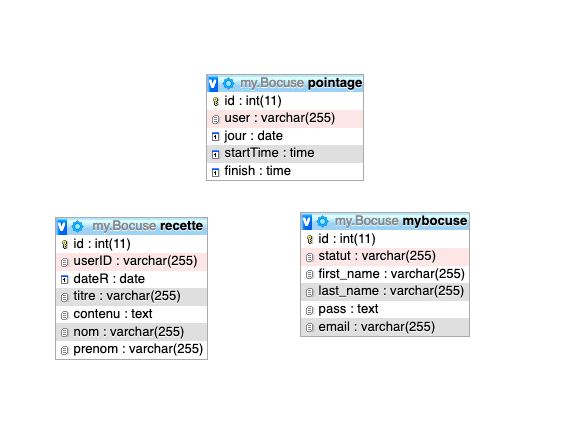

     

# Fullstack Group Project - my.Bocuse

made by [Florian BERTCHI](https://github.com/Bruxellesflorian), [Bérengère CARPENTIER](https://github.com/carpentierberengere), [Elise MULUMBA](https://github.com/elisemlbr) & [Igor DE SPIRLET](https://github.com/IgorDeSpi), trainees @ :office: Becode.

:green_apple: start date : 11/01/2021, 9am.  

:green_apple: end date : 14/01/2021, 7pm. 

Link to our group's [**TRELLO**](https://trello.com/b/yLfuWgWr/mybocuse) 

# my.Bocuse - what is it ?
myBocuse is the website for learners and chefs of the Bocuse's cooking bootcamp.

Through this website, they can organise *The Recette* presentations and lock a slot to do it, register their arrival and departure time, and much more. 

Click [***on this link***](http://mybocuse.great-site.net/) to visit our website !

# About the project 

## What is it ?
This group project is a consolidation project, meant to make us work both our frontend skills & what we learned so far about backend (PHP) and databases (mySQL).  
By groups of :four:, we need to create a login page where people could log into and it'll take them to a more general page, with more features (calendar, time locks, etc). 
We can always add more features if wa want (and have time) to, but we mostly follow the instructions given by our coaches. 
The following features are present :
* Ajoute une recette
* Pointage d'heure (matin & soir)
* Visionnage des recettes passées
* Recherche dans les recettes passées
* Visionnage Recette du Jour 

## What did we do ?
As we're working in groups, we split the work between front end and backend. 
First, we split the front end between two groups of two; the login page and the general page. After the bases and style is done, we'll start with the backend information as well as the database. 

## Databases

## What did we use ? 

* HTML/CSS
* PHP
* mySQL
* [Becode **Instructions**](https://github.com/becodeorg/bxl-hopper-1-25/tree/master/The%20Mountain/12.PHP/0.Projects/3.mybocuse)
* Varied **documentation** from the internet
* Website Host

DISCLAIMER - FAIR USE, THIS EXERCICE IS FOR EDUCATIONAL PURPOSE ONLY.
